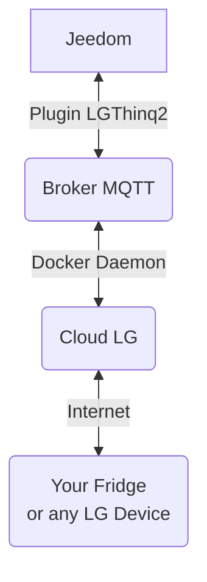

# Plugin lgthinq2

Plugin pour l'utilisation des appateils de la marque LG compatibles avec l'API `lgthinq`

Ce plugin nécessite d'avoir au préalable fait la configuration sur l'application propriétaire LG.

